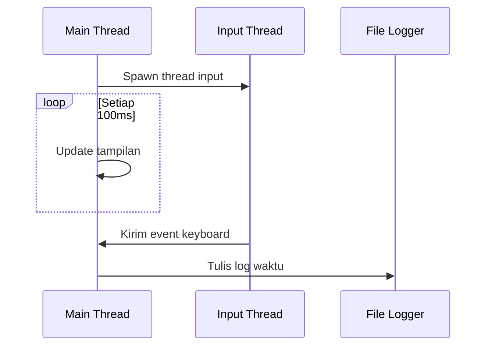

# CLI Stopwatch

Sebuah penghitung waktu berbasis command-line dengan kontrol keyboard realtime, dibuat menggunakan Rust.


## Fitur

- 🕒 Tampilan waktu realtime (jam:menit:detik)
- ⌨️ Kontrol keyboard:
  - `s` - Mulai
  - `p` - Jeda/Jedai
  - `r` - Ulang/Reset
  - `q` - Keluar
- 📝 Log waktu ke file `stopwatch.log`
- 🧵 Multi-thread untuk input non-blocking

## Apa yang harus disiapkan

- Rust 1.70+ dan Cargo
- Windows:
  - [Visual Studio 2022 Build Tools](https://visualstudio.microsoft.com/downloads/#build-tools-for-visual-studio-2022) dengan komponen "Desktop development with C++"
- Linux/macOS:
  - GCC atau Clang

## Instalasi

### 1. Install Rust

Untuk pengguna Windows:  
**Pastikan sudah install [Visual Studio Build Tools](https://visualstudio.microsoft.com/downloads/#build-tools-for-visual-studio-2022) terlebih dahulu**

1. Buka cmd/powershell
2. Install Rust pakai rustup:
```bash
curl --proto '=https' --tlsv1.2 -sSf https://sh.rustup.rs | sh
Restart terminal
```
3. Restart Terminal

### 2. Clone Repository
```bash
git clone https://github.com/namauser/rust-stopwatch.git
cd rust-stopwatch
```

### Build and Run
```bash
# Install dependencies
cargo build

# Jalankan program
cargo run --release
```

## Cara Penggunaan
Setelah program berjalan:
- Tekan `s` untuk memulai stopwatch
- Tekan `p` untuk jeda
- Tekan `r` untuk reset
- Tekan `q` untuk keluar

Contoh output:
```bash
12:34:56
```

Log waktu akan tersimpan di `stopwatch.log`:
```bash
[2024-03-15 14:30:45] Time: 123s
```

## Struktur Projek
```bash
.
├── Cargo.toml
├── Cargo.lock
├── src/
│   └── main.rs      # Kode utama
├── target/          # Hasil kompilasi
└── stopwatch.log    # File log otomatis dibuat
```

## Arsitektur


